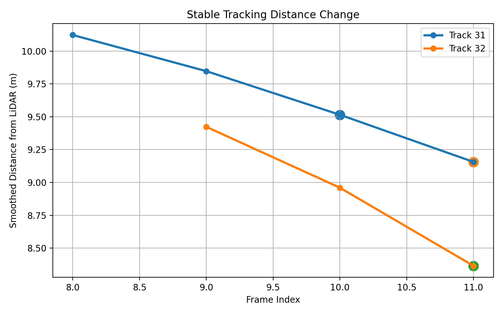
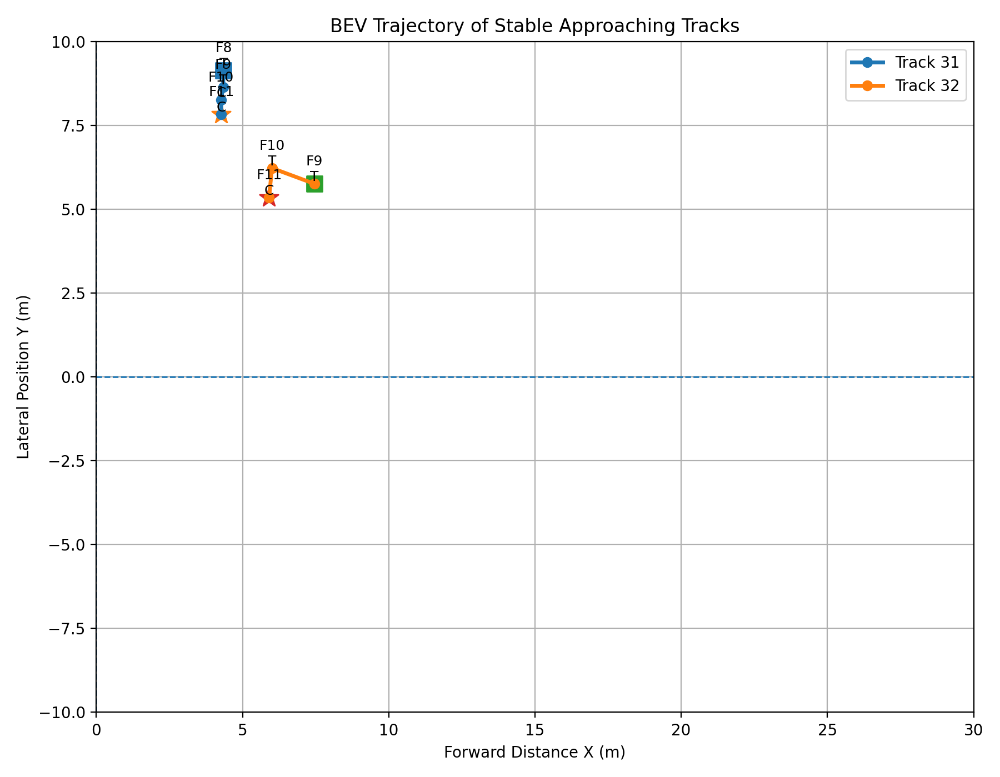

# LiDAR 3D Perception, Tracking, Risk Assessment, and Camera–LiDAR Fusion

## 1. Project Overview

This project builds a **LiDAR-based 3D perception and risk-assessment pipeline** using the nuScenes mini dataset.

The pipeline starts from **PointPillars-based 3D object detection** and expands into LiDAR sensor-characteristic analysis, temporal tracking, TTC/DCPA-based dynamic risk assessment, Camera–LiDAR late fusion, and ONNX Runtime optimization.

Main components:

- PointPillars-based 3D object detection
- Distance / point-density analysis
- Multi-sweep and pillar-resolution analysis
- Hungarian Matching + Kalman Filter tracking
- TTC / DCPA-based dynamic risk assessment
- Camera 2D detection and Camera–LiDAR late fusion
- GT-based multisensor coverage evaluation
- ONNX Runtime deployment optimization

The focus is not only on applying a 3D detector, but on analyzing **how LiDAR sensor characteristics affect detection performance**, connecting detections over time, converting relative motion into interpretable risk, compensating for single-sensor misses with camera information, and checking runtime efficiency for deployment.

---

## 2. Dataset

### nuScenes Mini

The project uses the **nuScenes v1.0-mini** dataset.

Used modalities and metadata:

- `LIDAR_TOP`
- `CAM_FRONT`
- ego pose
- calibrated sensor information
- sample annotations
- LiDAR sweeps

Dataset layout:

```text
nuscenes/
├── maps/
├── samples/
│   ├── LIDAR_TOP/
│   └── CAM_FRONT/
├── sweeps/
│   └── LIDAR_TOP/
└── v1.0-mini/
```

The dataset is stored outside the Git repository and linked symbolically:

```text
data/nuscenes -> /media/rani/새 볼륨/nuscenes
```

PointPillars evaluation split:

| Split | Samples |
|---|---:|
| Train | 323 |
| Validation | 81 |
| Total | 404 |

---

## 3. End-to-End Architecture

```text
nuScenes LiDAR + Camera
        │
        ├── LiDAR → PointPillars 3D Detection
        │              │
        │              ├── Distance / Density / Sweep Analysis
        │              │
        │              └── Hungarian + Kalman Tracking
        │                              │
        │                              └── TTC + DCPA Risk
        │
        └── CAM_FRONT → YOLO 2D Detection
                               │
                     Camera–LiDAR Association
                               │
                     Multisensor Coverage Eval
                               │
                     Structured Risk / Fusion Output
                               │
                     ONNX Runtime Benchmark
```

---

## 4. PointPillars 3D Detection

### 6.1 Model Configuration

The extended pipeline uses the OpenPCDet implementation of **PointPillars**.

```text
Point Cloud Range
[-51.2, -51.2, -5.0, 51.2, 51.2, 3.0]

Pillar Size
[0.2, 0.2, 8.0]

Max Points per Pillar
20

Input Sweeps
10
```

Architecture:

```text
Voxel / Pillar Generation
→ PillarVFE
→ PointPillarScatter
→ BaseBEVBackbone
→ AnchorHeadMulti
→ 3D Detection
```

Classes:

```text
car, truck, construction_vehicle, bus, trailer,
barrier, motorcycle, bicycle, pedestrian, traffic_cone
```

### 6.2 Pretrained Baseline Evaluation

A pretrained PointPillars checkpoint trained on the full nuScenes dataset was evaluated on the nuScenes mini validation split.

> **Important:** this is a pretrained baseline evaluation, not a model trained from scratch on nuScenes mini.

| Metric | Result |
|---|---:|
| Validation Samples | 81 |
| mAP | 0.4134 |
| NDS | 0.4920 |

---

## 5. LiDAR Sensor Characteristic Analysis

### 5.1 Distance-based Detection Recall

Custom diagnostic condition:

```text
same class
prediction score >= 0.30
center distance <= 2 m
```

This is an auxiliary diagnostic, not the official nuScenes mAP metric.

| Distance | GT | Matched | Recall |
|---|---:|---:|---:|
| 0–20 m | 1,513 | 1,151 | 0.761 |
| 20–40 m | 1,967 | 1,180 | 0.600 |
| 40–50 m | 461 | 123 | 0.267 |

Detection recall decreased sharply with distance.

### 5.2 Current-sweep Point Density

Current-frame LiDAR points inside GT boxes were counted to inspect sensor sparsity.

| Distance | Objects | Mean Points | Median Points | Recall |
|---|---:|---:|---:|---:|
| 0–20 m | 1,513 | 115.8 | 29 | 0.761 |
| 20–40 m | 1,967 | 9.6 | 4 | 0.600 |
| 40–50 m | 461 | 2.7 | 1 | 0.267 |

Observed trend:

```text
increasing distance
→ lower point density
→ lower detection recall
```

Point count is not the only cause; class, occlusion, orientation, and scene structure also affect detection.

### 5.3 Multi-sweep Ablation

The same pretrained 10-sweep checkpoint was evaluated with reduced input sweeps.

> This is an **input ablation / robustness experiment**, not sweep-specific retraining.

| Input Sweeps | mAP | NDS |
|---:|---:|---:|
| 1 | 0.3135 | 0.3535 |
| 5 | 0.3717 | 0.4485 |
| 10 | **0.4134** | **0.4920** |

Distance recall:

| Sweeps | 0–20 m | 20–40 m | 40–50 m |
|---:|---:|---:|---:|
| 1 | 0.619 | 0.378 | 0.072 |
| 5 | 0.705 | 0.541 | 0.206 |
| 10 | **0.761** | **0.600** | **0.267** |

Temporal sweep accumulation helped compensate for sparse LiDAR information, especially at longer ranges.

### 5.4 Pillar Resolution Ablation

The pretrained `0.20 m` checkpoint was evaluated with different pillar sizes.

| Pillar Size | mAP | NDS | sec / example |
|---:|---:|---:|---:|
| 0.16 m | 0.3480 | 0.4363 | 0.1209 |
| 0.20 m | **0.4134** | **0.4920** | 0.0692 |
| 0.32 m | 0.1401 | 0.2538 | 0.0883 |

> The checkpoint was trained with `0.20 m` pillars. This is therefore a **resolution-mismatch ablation**, not a fair comparison of independently trained pillar resolutions.

---

## 6. 3D Object Tracking

PointPillars detections were connected across time using:

```text
PointPillars Detection
→ Class-aware Hungarian Matching
→ Kalman Filter
→ Confirmed Track
```

Tracking is performed in the global coordinate frame to account for ego motion.

Kalman state:

```text
[x, y, vx, vy]
```

Main parameters:

```text
score threshold = 0.30
matching distance = 4 m
minimum hits = 3
maximum age = 2
```

Evaluation result:

| Metric | Result |
|---|---:|
| Confirmed Track Rows | 2,010 |
| GT Observations | 4,267 |
| Matched Observations | 1,947 |
| GT Match Rate | 0.456 |
| Matched GT Instances | 157 |
| Stable Instances | 96 |
| Stable Instance Rate | 0.611 |
| ID Switches | 115 |
| ID Switch Rate | 0.064 |

The GT match rate is influenced by detector recall, score threshold, and confirmed-track filtering, so it is not a pure tracker metric.

---

## 7. Dynamic Risk Assessment

### 7.1 TTC

For each confirmed track, ego motion and object motion were used to estimate radial closing speed and Time-To-Collision.

Initial heuristic thresholds:

```text
DANGER  : TTC < 2 s
WARNING : TTC < 4 s
CAUTION : TTC < 8 s
SAFE    : otherwise
```

Result:

| Risk | Count |
|---|---:|
| SAFE | 1,368 |
| CAUTION | 351 |
| WARNING | 264 |
| DANGER | 27 |

TTC alone can overestimate risk when paths cross without an actual near-collision.

### 7.2 TTC + DCPA

DCPA was added to estimate minimum spatial separation at the closest point of approach.

```text
DANGER  : TTC < 2 s AND DCPA < 2 m
WARNING : TTC < 4 s AND DCPA < 4 m
CAUTION : TTC < 8 s AND DCPA < 6 m
SAFE    : otherwise
```

Result:

| Risk | Count |
|---|---:|
| SAFE | 1,781 |
| CAUTION | 207 |
| WARNING | 22 |
| DANGER | 0 |

Representative case:

```text
Track 196
Class = car
Distance = 7.09 m
Closing Speed = 12.88 m/s
TTC = 0.55 s
DCPA = 3.44 m
Risk = WARNING
```

DCPA suppresses TTC-only over-warning when an object is rapidly approaching but is not predicted to pass inside the closest-danger separation threshold.

> TTC / DCPA thresholds are experimental heuristics and are not certified automotive safety thresholds.

---

## 8. Camera–LiDAR Fusion

### 8.1 Geometric Alignment

nuScenes calibration information was used to transform LiDAR 3D detections into the CAM_FRONT image plane.

```text
LiDAR
→ ego vehicle
→ global
→ camera ego
→ camera sensor
→ image projection
```

This verified spatial alignment between PointPillars detections and camera objects.

### 8.2 Camera Detection

CAM_FRONT images were processed using YOLO11n.

Mapped classes:

```text
car, truck, bus, motorcycle, bicycle, pedestrian
```

For `scene-0103`:

| Metric | Result |
|---|---:|
| Frames | 40 |
| Camera Detections | 672 |

### 8.3 Late Fusion

Camera and LiDAR detections were associated in the image plane using:

```text
same class
+ 2D IoU
+ Hungarian Matching
```

For matched objects, camera and LiDAR confidence scores were combined while preserving LiDAR 3D position and distance.

```text
fusion_score
= 0.60 × camera_score
+ 0.40 × lidar_score
```

The fusion score is an object-level combined score and is not guaranteed to be higher than either individual sensor score.

### 8.4 Multisensor Coverage Evaluation

A custom GT-coverage diagnostic was performed over `scene-0103`.

Evaluation conditions:

- CAM_FRONT-visible GT only
- class-consistent one-to-one matching
- Camera: 2D IoU >= 0.50
- LiDAR: center distance <= 2 m
- LiDAR score >= 0.30

| Method | Matched GT | Coverage Recall |
|---|---:|---:|
| Camera-only | 316 | 0.432 |
| LiDAR-only | 195 | 0.266 |
| **Fusion Union** | **377** | **0.515** |
| Both Sensors | 134 | 0.183 |

Total CAM_FRONT-visible GT objects:

```text
732
```

Fusion gain:

```text
vs Camera-only : +0.083
vs LiDAR-only  : +0.249
```

This indicates that the two sensors have complementary detection behavior and can compensate for different failure cases.

> Coverage Recall is a custom diagnostic metric, not an official nuScenes multimodal benchmark metric.

---

## 9. Edge / Deployment Optimization

### 9.1 ONNX Export

The PointPillars `BaseBEVBackbone` was exported to ONNX.

```text
Input : spatial_features    (1, 64, 512, 512)
Output: spatial_features_2d (1, 384, 128, 128)
```

Validation:

| Metric | Result |
|---|---:|
| ONNX Checker | PASS |
| 99th Percentile Abs. Diff | 0.00143294 |
| 99.9th Percentile Abs. Diff | 0.00395483 |
| Relative L2 Error | 0.00173204 |

This verifies feature-level numerical consistency within a small error range.

> Only the BEV backbone was exported. This is not a full end-to-end PointPillars ONNX deployment.

### 9.2 Runtime Benchmark

Benchmark condition:

```text
Input shape: (1, 64, 512, 512)
Warmup: 20
Runs: 100
```

| Runtime | Device | Mean Latency | p50 | p95 | FPS |
|---|---|---:|---:|---:|---:|
| PyTorch | GPU | **12.333 ms** | 12.410 ms | 12.727 ms | **81.08** |
| PyTorch | CPU | 352.772 ms | 264.290 ms | 1230.809 ms | 2.83 |
| ONNX Runtime | CPU | **162.872 ms** | 162.843 ms | 163.803 ms | **6.14** |

CPU optimization result:

```text
PyTorch CPU → ONNX Runtime CPU
352.772 ms → 162.872 ms
2.17× speedup
```

> GPU FPS refers only to the `BaseBEVBackbone` benchmark and must not be interpreted as end-to-end PointPillars FPS.

<<<<<<< HEAD
---

## 10. Key Results

| Area | Result |
|---|---|
| PointPillars Baseline | mAP 0.4134 / NDS 0.4920 |
| Distance Analysis | Recall 0.761 → 0.600 → 0.267 with increasing distance |
| Sweep Ablation | mAP 0.3135 → 0.3717 → 0.4134 for 1 / 5 / 10 sweeps |
| Tracking | ID Switch Rate 0.064 |
| Dynamic Risk | TTC + DCPA reduced TTC-only over-warning |
| Camera Coverage | 0.432 |
| LiDAR Coverage | 0.266 |
| Fusion Coverage | **0.515** |
| Fusion Gain | +0.083 vs Camera / +0.249 vs LiDAR |
| ONNX CPU Optimization | **2.17× speedup** |
| Backbone GPU Runtime | 12.333 ms / 81.08 FPS |

---

## 11. Project Structure

```text
lidar-risk-tracking/
├── assets/
├── configs/
├── data/
│   └── nuscenes -> external dataset
├── outputs/
│   └── 
├── src/
│   ├── analysis/
│   ├── edge/
│   ├── fusion/
│   ├── inference/
│   └── risk/
├── .gitignore
├── README.md
├── README_ko.md
└── requirements.txt
```

`third_party/OpenPCDet/` is kept locally for execution but excluded from Git tracking. OpenPCDet should be installed or cloned separately when reproducing the project.

---

## 12. Main Outputs
=======
## 14.2 ROI and Ground Removal

ROI filtering reduced the original point cloud to the front region, and ground removal separated road surface points from non-ground object candidate points.

## 14.3 DBSCAN Clustering and 3D Bounding Boxes

DBSCAN clustering generated object candidate clusters from non-ground points.  
Each cluster was represented using its center point, 3D bounding box, point count, size, and distance from LiDAR.

## 14.4 Distance Change of Confirmed Tracks



Track 31 and Track 32 were confirmed after being matched across multiple frames.  
Both tracks showed decreasing smoothed distance, indicating approaching object candidates.

## 14.5 BEV Tracking Visualization



Track 31 and Track 32 were visualized in bird’s-eye view to show the spatial trajectory of stable approaching object candidates.  
`T` indicates a tentative track, while `C` indicates a confirmed track after being matched across multiple frames.

# 15. Key Insights

1. Raw LiDAR point clouds require ROI filtering before object-level analysis.
2. Ground removal significantly affects DBSCAN clustering quality.
3. DBSCAN can generate object candidates without labels, but is sensitive to point density and structure fragments.
4. Baseline nearest-neighbor tracking can produce many short-lived track IDs.
5. Hungarian matching reduces order-dependent matching instability.
6. Confirmed track logic prevents temporary clusters from immediately affecting risk decisions.
7. Smoothed distance helps reduce unstable risk decisions caused by frame-level distance fluctuation.
8. Stable tracking improved the interpretability of proximity risk assessment.

---

# 16. Limitations

This project does not perform deep learning-based 3D object detection.

Therefore, the DBSCAN clusters are:

```text
spatial object candidates
```

not semantic objects such as:

```text
car, pedestrian, cyclist
```

Current limitations include:

* DBSCAN cluster fragmentation
* structure fragments being detected as object candidates
* ID switches caused by cluster split or merge
* lack of semantic class prediction
* lack of label-based 3D detection evaluation
* no real-time sensor input from physical LiDAR hardware

---

# 17. Tech Stack

## Programming

* Python
* NumPy
* Pandas
* JSON

## Point Cloud Processing

* nuScenes-devkit
* Open3D
* scikit-learn DBSCAN
* SciPy Hungarian Matching

## Visualization

* Matplotlib
* Open3D

## Dataset

* nuScenes mini

---

# 19. Future Work

Potential future improvements include:

* Kalman Filter-based motion prediction
* Hungarian matching with velocity-aware cost
* PointPillars or CenterPoint-based 3D object detection
* semantic class-aware risk assessment
* label-based 3D bounding box evaluation
* camera-LiDAR fusion
* real-time LiDAR sensor inference

---

# 20. Conclusion
>>>>>>> origin/main

```text
outputs/
├── camera_lidar/
│   ├── camera_lidar_fusion_portfolio.png
│   └── multisensor_coverage_scene0103_corrected.csv
├── edge/
│   └── pointpillars_backbone.onnx
├── portfolio/
│   ├── pointpillars_detection.png
│   └── tracking_risk_bev.png
├── tracking_risk_bev/
│   ├── scene-0103_frame_36.png
│   ├── scene-0103_frame_37.png
│   └── scene-0103_frame_38.png
├── analysis/
│   ├── distance_recall.csv
│   ├── point_density_summary.csv
|   ├── sweep_distance_recall.csv
│   └── tracking_stability.csv
```

---

## 13. Tech Stack

### Programming

- Python
- NumPy
- Pandas

### Deep Learning / 3D Detection

<<<<<<< HEAD
- PyTorch
- OpenPCDet
- PointPillars
- spconv

### Point Cloud / Sensor Processing

- nuScenes-devkit
- scikit-learn
- SciPy

### Tracking / Risk

- Hungarian Matching
- Kalman Filter
- TTC
- DCPA

### Camera / Multisensor

- Ultralytics YOLO11
- nuScenes calibration
- Camera–LiDAR geometric projection
- IoU-based late fusion

### Deployment

- ONNX
- ONNX Runtime

### Visualization

- Matplotlib

---

## 14. Limitations

1. The PointPillars checkpoint was pretrained on the full nuScenes dataset. Reported mAP / NDS values are evaluation results, not self-trained model performance.
2. Sweep and pillar-size experiments reuse the same pretrained checkpoint and are robustness / mismatch ablations rather than independently trained fair comparisons.
3. Tracking metrics are affected by detector recall and confirmed-track filtering.
4. TTC / DCPA thresholds are heuristic experimental settings and are not automotive safety-certified thresholds.
5. Camera–LiDAR Coverage Recall is a custom diagnostic metric, not an official nuScenes multimodal metric.
6. The current late-fusion method uses geometric association and confidence combination rather than an end-to-end learned multimodal model.
7. ONNX optimization was evaluated for the PointPillars BEV backbone, not the full end-to-end detector.
8. The project uses recorded nuScenes data rather than live physical LiDAR input.

---

## 15. Key Insights

1. LiDAR detection performance decreases strongly with range as point density becomes sparse.
2. Temporal sweep accumulation can mitigate sparse long-range observations.
3. Detection quality cannot be explained by point count alone; class, occlusion, and geometry also matter.
5. Hungarian Matching and Kalman filtering provide a practical temporal layer over frame-level 3D detections.
6. TTC alone can over-warn; DCPA adds predicted path-separation information.
7. Camera and LiDAR show complementary detection behavior, raising union coverage to 0.515.
8. ONNX Runtime reduced BEV-backbone CPU latency from 352.772 ms to 162.872 ms, a 2.17× speedup.

---

## 16. Conclusion

```text
PointPillars 3D Detection
→ LiDAR Sensor Analysis
→ Hungarian + Kalman Tracking
→ TTC + DCPA Risk Assessment
→ Camera–LiDAR Fusion
→ GT-based Coverage Evaluation
→ ONNX Runtime Optimization
```

The most important outcome is not simply the use of PointPillars.

> **LiDAR sensor characteristics were analyzed quantitatively, 3D detections were connected over time, relative motion was converted into interpretable risk, camera information was used to compensate for LiDAR detection failures, and deployment efficiency was evaluated through ONNX Runtime optimization.**

This provides a practical foundation for real-time multimodal perception, edge deployment, and sensor-based safety monitoring.
=======
> tracking stability can be improved by combining Hungarian matching, confirmed track filtering, and smoothed distance-based risk assessment.
