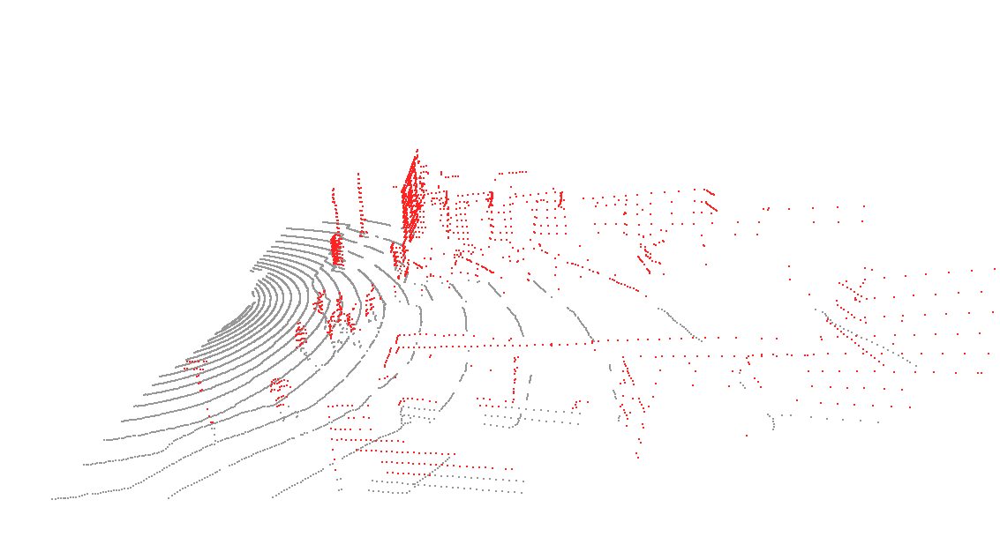
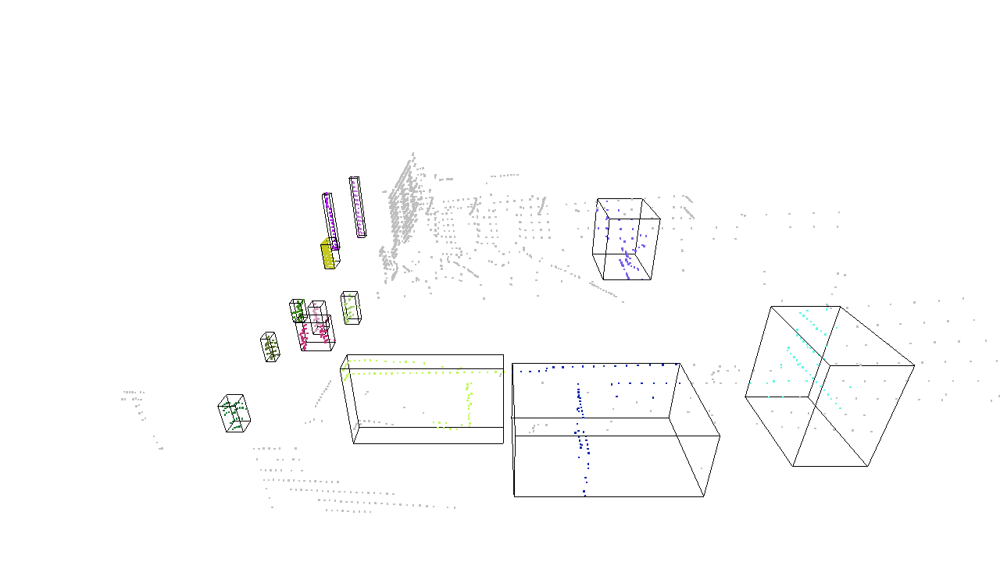

# LiDAR Point Cloud Object Tracking and Proximity Risk Assessment Pipeline

## 1. Project Overview

This project implements a LiDAR point cloud-based object candidate tracking and proximity risk assessment pipeline using the nuScenes mini dataset.

The project focuses on converting raw LiDAR sensor data into a structured decision output through a complete perception pipeline.

Instead of directly training a 3D object detection model, this project explores:

* LiDAR point cloud loading and visualization
* front region of interest filtering
* ground point removal
* DBSCAN-based object candidate clustering
* 3D bounding box generation
* frame-to-frame object candidate tracking
* tracking stabilization using confirmed track logic
* smoothed distance-based risk assessment
* CSV / JSON output generation

The primary goal was not only to visualize LiDAR point clouds, but also to analyze how point cloud preprocessing, clustering, and tracking stability affect proximity risk decisions.

---

# 2. Problem Definition

LiDAR point cloud-based perception presents several practical challenges:

* raw point clouds contain surrounding 360-degree sensor information
* road surface points dominate the scene and interfere with clustering
* sparse point clouds can fragment object candidates
* structure fragments can be detected as false object candidates
* unstable clustering results can cause tracking ID switches across frames
* short-lived clusters can incorrectly affect risk decisions

Therefore, this project focused on:

> building a LiDAR perception pipeline that extracts object candidates from point cloud data, tracks them across consecutive frames, and estimates proximity risk based on distance change.

---

# 3. Dataset

## nuScenes Mini Dataset

The project was implemented using the nuScenes mini dataset.

The dataset contains autonomous driving sensor data, including:

* LiDAR point cloud data
* camera data
* metadata
* ego pose information
* sensor calibration information
* scene/sample annotations

For this project, the main input modality was the top LiDAR sensor:

```text
samples/LIDAR_TOP/
```

Dataset structure:

```text
nuscenes/
├── maps
├── samples
│   └── LIDAR_TOP
├── sweeps
│   └── LIDAR_TOP
└── v1.0-mini
```

The dataset was linked to the project directory using a symbolic link:

```text
data/nuscenes -> /media/rani/새 볼륨/nuscenes
```

This allowed the project code to use a consistent local path while storing the large dataset outside the Git repository.

---

# 4. Pipeline

```text
LiDAR Point Cloud
→ Front ROI Filtering
→ Ground Removal
→ DBSCAN Clustering
→ Cluster Filtering
→ 3D Bounding Box Generation
→ Frame-to-Frame Tracking
→ Track Confirmation
→ Smoothed Distance Calculation
→ Risk Assessment
→ CSV / JSON Output
```


---

# 5. LiDAR Point Cloud Loading

## 5.1 Input Data

The nuScenes LiDAR point cloud was loaded from the `LIDAR_TOP` sensor data.

Each LiDAR point contains spatial and intensity information:

```text
x, y, z, intensity
```

For this project, the 3D spatial coordinates were mainly used:

```text
x: forward / backward direction
y: left / right direction
z: height
```

---

## 5.2 Initial Point Cloud Visualization

The raw LiDAR point cloud was visualized using Open3D.

This step confirmed that:

* the nuScenes mini dataset was correctly linked
* LiDAR point cloud files were successfully loaded
* 3D point cloud visualization was working

---

# 6. Front ROI Filtering

## 6.1 Motivation

Raw LiDAR point clouds contain surrounding 360-degree information.

However, for forward proximity risk assessment, the main target area is the front region of the ego vehicle.

Therefore, front ROI filtering was applied to remove unnecessary points and focus on the risk-relevant area.

---

## 6.2 ROI Range

The following ROI range was applied:

```text
x: 2.0m ~ 30.0m
y: -10.0m ~ 10.0m
z: -3.0m ~ 3.0m
```

The minimum x value was set to 2.0m to remove ego-vehicle-adjacent noise and sensor-near artifacts.

---

## 6.3 ROI Filtering Result

Example point count:

| Stage | Point Count |
| --- | ---: |
| Original Point Cloud | 34,688 |
| Front ROI Points | 9,924 |
| Removed Points | 24,764 |

This step reduced the point cloud to the region most relevant for forward risk assessment.

---

# 7. Ground Removal

## 7.1 Motivation

The majority of LiDAR points in driving scenes often belong to the road surface.

If ground points remain, DBSCAN clustering can incorrectly group road scan lines or ground structures as object candidates.

Therefore, ground removal was applied before clustering.

---

## 7.2 Height-based Ground Removal

A simple z-threshold based ground removal method was used.

```text
non-ground point: z > threshold
ground point: z <= threshold
```

This method is simple and fast, making it suitable as a baseline ground removal approach.

---

## 7.3 Threshold Comparison

Different z-threshold values were tested.

| z-threshold | Ground Points | Non-ground Points | Observation |
| ---: | ---: | ---: | --- |
| -1.0 | 7,684 | 2,240 | More aggressive ground removal |
| -1.2 | 7,663 | 2,261 | Balanced baseline |
| -1.4 | 7,593 | 2,331 | More non-ground points preserved |

### Key Observation

A lower threshold preserved more non-ground points, but also increased the possibility of retaining near-ground noise.

A higher threshold removed more points, but could remove low-height object structures.

Therefore, this project used:

```text
z_threshold = -1.4
```

to preserve object candidate points during clustering and tracking.



---

# 8. DBSCAN-based Object Candidate Clustering

## 8.1 Motivation

After ROI filtering and ground removal, non-ground points were clustered to generate object candidates.

DBSCAN was selected because:

* it does not require a predefined number of clusters
* it can separate dense point groups
* it can classify sparse points as noise

---

## 8.2 DBSCAN Setup

Baseline DBSCAN parameters:

```text
eps = 0.6
min_samples = 6
```

The clustering was applied to the 3D point coordinates:

```text
x, y, z
```

---

## 8.3 Cluster Filtering

Initial DBSCAN results included:

* small sparse noise clusters
* thin structural fragments
* ego-vehicle-adjacent clusters
* overly large structure clusters

To improve object candidate quality, cluster filtering was applied using the following conditions:

```text
distance >= 3.0m
num_points >= 30
width_x >= 0.2m
width_y >= 0.2m
height_z >= 0.3m
width_x <= 5.0m
width_y <= 5.0m
height_z <= 3.5m
```

---

## 8.4 Clustering Result

Example frame result:

| Metric | Result |
| --- | ---: |
| Original Points | 34,720 |
| ROI Points | 8,662 |
| Non-ground Points | 2,421 |
| DBSCAN Clusters | 13 |
| Noise Points | 225 |

Cluster information included:

* cluster ID
* number of points
* center position
* 3D bounding box size
* distance from LiDAR



---

# 9. Frame Selection for Tracking

## 9.1 Motivation

A single LiDAR frame may not contain enough meaningful object candidates.

Therefore, all 404 samples in the nuScenes mini dataset were processed to find frames suitable for clustering and tracking visualization.

---

## 9.2 Frame Search Result

The following sample was selected as a representative frame:

```text
sample_idx = 48
```

Example result:

| Metric | Result |
| --- | ---: |
| ROI Points | 8,662 |
| Non-ground Points | 2,421 |
| Cluster Count | 13 |

The selected frame provided enough object candidates for visualization and tracking analysis.

---

# 10. Baseline Tracking

## 10.1 Motivation

After extracting object candidates frame-by-frame, the next step was to maintain object identity across frames.

The baseline tracker used cluster center distance for frame-to-frame matching.

---

## 10.2 Nearest-neighbor Tracking

The baseline tracking method matched each current cluster to the nearest previous cluster center.

For each tracked object, the following values were calculated:

* track ID
* center position
* distance from LiDAR
* speed per frame
* approach delta
* approaching status
* risk level

---

## 10.3 Baseline Tracking Result

Baseline tracking summary:

| Metric | Result |
| --- | ---: |
| Total Frames | 11 |
| Total Detections | 61 |
| Total Tracks | 38 |
| Stable Tracks | 5 |
| Approaching Tracks | 4 |
| Stable Approaching Tracks | 2 |
| Minimum Distance | 5.623 m |

Risk count by object:

| Risk Level | Count |
| --- | ---: |
| SAFE | 28 |
| CAUTION | 21 |
| WARNING | 12 |
| DANGER | 0 |

### Key Observation

The baseline tracker successfully identified approaching object candidates.

However, several issues were observed:

* track IDs were frequently newly created
* short-lived clusters were included in risk assessment
* temporary cluster noise sometimes affected frame-level risk decisions

This motivated the stable tracking improvement.

---

# 11. Stable Tracking Improvement

## 11.1 Motivation

The baseline tracking approach was sensitive to unstable DBSCAN clusters.

To improve tracking stability, three strategies were introduced:

* Hungarian matching
* confirmed track condition
* smoothed distance-based risk assessment

---

## 11.2 Hungarian Matching

Instead of greedy nearest-neighbor matching, a distance cost matrix was constructed between:

```text
previous track centers
current detection centers
```

Hungarian matching was then applied to find a globally optimal assignment.

This reduced order-dependent matching errors.

---

## 11.3 Confirmed Track Condition

Temporary clusters should not immediately affect risk assessment.

Therefore, each track was classified as:

```text
tentative track: hits < 3
confirmed track: hits >= 3
```

Only confirmed tracks were actively used for risk decision.

This reduced the influence of short-lived noise clusters.

---

## 11.4 Smoothed Distance

Raw LiDAR distance can fluctuate between frames.

To reduce unstable risk decisions, smoothed distance was calculated using an exponential moving average:

```text
smoothed_distance = alpha * current_distance + (1 - alpha) * previous_smoothed_distance
```

Applied value:

```text
alpha = 0.6
```

The risk decision was based on smoothed distance instead of raw distance.

---

# 12. Stable Tracking Result

## 12.1 Summary

Stable tracking summary:

| Metric | Result |
| --- | ---: |
| Total Frames | 11 |
| Total Detections | 61 |
| Total Tracks | 35 |
| Confirmed Tracks | 9 |
| Stable Approaching Tracks | 4 |
| Confirmed Detections | 13 |
| Tentative Detections | 48 |
| Minimum Raw Distance | 5.623 m |
| Minimum Smoothed Distance | 5.623 m |

---

## 12.2 Risk Distribution

Risk count for all objects:

| Risk Level | Count |
| --- | ---: |
| SAFE | 50 |
| CAUTION | 4 |
| WARNING | 7 |
| DANGER | 0 |

Risk count for confirmed objects:

| Risk Level | Count |
| --- | ---: |
| SAFE | 2 |
| CAUTION | 4 |
| WARNING | 7 |
| DANGER | 0 |

Frame-level max risk:

| Risk Level | Frame Count |
| --- | ---: |
| SAFE | 6 |
| CAUTION | 1 |
| WARNING | 4 |
| DANGER | 0 |

---

## 12.3 Stable Approaching Tracks

Top stable approaching tracks:

| Track ID | Frames | Confirmed Frames | Smoothed Distance Change | Delta | Max Risk |
| ---: | ---: | ---: | --- | ---: | --- |
| 2 | 4 | 2 | 8.931m → 7.257m | 1.673m | WARNING |
| 32 | 3 | 1 | 9.423m → 8.365m | 1.058m | WARNING |
| 31 | 4 | 2 | 10.122m → 9.156m | 0.966m | WARNING |
| 3 | 3 | 1 | 7.377m → 6.428m | 0.949m | WARNING |

### Key Observation

After applying stable tracking, short-lived detections were handled more conservatively.

Most tentative detections were classified as `SAFE`, while confirmed approaching tracks were used for meaningful `WARNING` decisions.

---

# 13. Risk Assessment

## 13.1 Risk Logic

Risk level was determined using:

* smoothed distance
* approaching status
* confirmed track status

Risk rules:

```text
If not confirmed:
    distance < 5m  → CAUTION
    otherwise      → SAFE

If confirmed:
    distance < 5m                  → DANGER
    distance < 10m and approaching → WARNING
    distance < 10m                 → CAUTION
    distance < 15m and approaching → CAUTION
    otherwise                      → SAFE
```

---

## 13.2 Output Example

Example JSON output:

```json
{
  "frame_idx": 11,
  "track_id": 31,
  "distance_m": 8.917,
  "smoothed_distance_m": 9.156,
  "is_confirmed": true,
  "track_hits": 4,
  "is_approaching": true,
  "risk_level": "WARNING"
}
```

The final output was saved as:

```text
outputs/logs/tracking_results_stable.csv
outputs/logs/tracking_results_stable.json
outputs/logs/stable_tracking_summary.json
```

---

# 14. Visualization Analysis

## 14.1 Point Cloud Visualization

The raw LiDAR point cloud was visualized using Open3D to confirm sensor data loading.

## 14.2 ROI and Ground Removal

ROI filtering reduced the original point cloud to the front region, and ground removal separated road surface points from non-ground object candidate points.

## 14.3 DBSCAN Clustering and 3D Bounding Boxes

DBSCAN clustering generated object candidate clusters from non-ground points.  
Each cluster was represented using its center point, 3D bounding box, point count, size, and distance from LiDAR.

## 14.4 Distance Change of Confirmed Tracks


Track 31 and Track 32 were confirmed after being matched across multiple frames.  
Both tracks showed decreasing smoothed distance, indicating approaching object candidates.

## 14.5 BEV Tracking Visualization


Track 31 and Track 32 were visualized in bird’s-eye view to show the spatial trajectory of stable approaching object candidates.  
`T` indicates a tentative track, while `C` indicates a confirmed track after being matched across multiple frames.

# 15. Key Insights

1. Raw LiDAR point clouds require ROI filtering before object-level analysis.
2. Ground removal significantly affects DBSCAN clustering quality.
3. DBSCAN can generate object candidates without labels, but is sensitive to point density and structure fragments.
4. Baseline nearest-neighbor tracking can produce many short-lived track IDs.
5. Hungarian matching reduces order-dependent matching instability.
6. Confirmed track logic prevents temporary clusters from immediately affecting risk decisions.
7. Smoothed distance helps reduce unstable risk decisions caused by frame-level distance fluctuation.
8. Stable tracking improved the interpretability of proximity risk assessment.

---

# 16. Limitations

This project does not perform deep learning-based 3D object detection.

Therefore, the DBSCAN clusters are:

```text
spatial object candidates
```

not semantic objects such as:

```text
car, pedestrian, cyclist
```

Current limitations include:

* DBSCAN cluster fragmentation
* structure fragments being detected as object candidates
* ID switches caused by cluster split or merge
* lack of semantic class prediction
* lack of label-based 3D detection evaluation
* no real-time sensor input from physical LiDAR hardware

---

# 17. Tech Stack

## Programming

* Python
* NumPy
* Pandas
* JSON

## Point Cloud Processing

* nuScenes-devkit
* Open3D
* scikit-learn DBSCAN
* SciPy Hungarian Matching

## Visualization

* Matplotlib
* Open3D

## Dataset

* nuScenes mini

---

# 19. Future Work

Potential future improvements include:

* Kalman Filter-based motion prediction
* Hungarian matching with velocity-aware cost
* PointPillars or CenterPoint-based 3D object detection
* semantic class-aware risk assessment
* label-based 3D bounding box evaluation
* camera-LiDAR fusion
* real-time LiDAR sensor inference

---

# 20. Conclusion

This project implemented a LiDAR point cloud-based object candidate tracking and proximity risk assessment pipeline.

The pipeline includes:

* LiDAR point cloud loading
* ROI filtering
* ground removal
* DBSCAN-based object candidate clustering
* 3D bounding box generation
* frame-to-frame tracking
* confirmed track stabilization
* smoothed distance-based risk assessment
* structured CSV / JSON output

The project demonstrated that:

> even without training a 3D detection model, LiDAR point cloud data can be processed into object candidate tracks and proximity risk decisions through a structured perception pipeline.

It also showed that:

> tracking stability can be improved by combining Hungarian matching, confirmed track filtering, and smoothed distance-based risk assessment.
